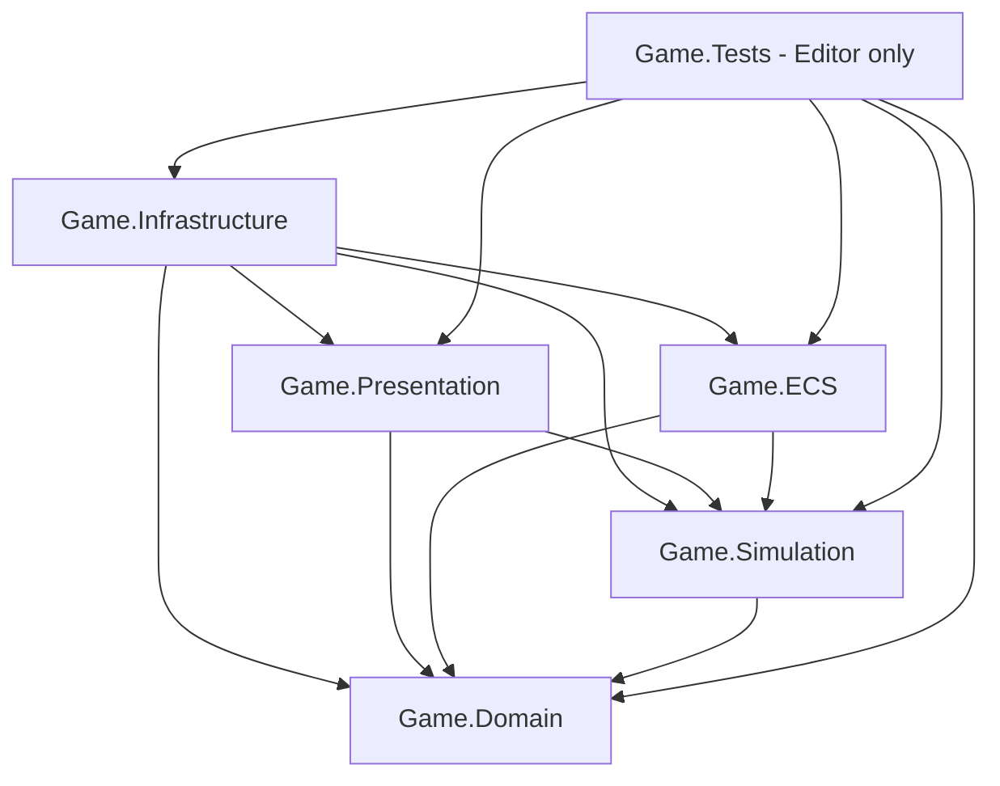

# Architecture — U01

## Scope and source
Implemented in U01: five runtime assembly boundaries and Game.Tests (EditMode), dependency checks, and this architecture contract. Runtime files contain assembly metadata only; services below are ownership contracts for later tasks, not implemented gameplay. FRS_Unity.docx sections 4, 33, 39–40 and 42.2–42.7 guide the design. D-008 overrides the original Editor target with Unity 6000.6.4f1.

## Compile-time dependencies
An arrow means a direct assembly reference. All runtime assemblies live under Assets/Game/<layer> and use the matching Game.<layer> namespace.

| Assembly | Direct project references | Ownership |
|---|---|---|
| Game.Domain | None | Stable IDs, canonical serializable world/person/cohort models, invariants, pure rules and definition values (U04 onward). |
| Game.Simulation | Domain | Clock/calendar (U03), centralized tick scheduling, use cases, commands/queries, RNG streams, tier transitions and aggregate simulation. Defines ports consumed by orchestration. |
| Game.ECS | Domain, Simulation | Tier2 components/jobs/systems and adapter implementing the Simulation tier execution port. Maps stable IDs to transient Entity handles. DOTS implementation starts U12. |
| Game.Presentation | Domain, Simulation | Tier1 views, cameras/input, UI, animation/audio/VFX; converts input into commands and renders snapshots/events. No ownership of persistent state. |
| Game.Infrastructure | Domain, Simulation, ECS, Presentation | Application composition root, save codecs/storage/migrations, configuration and content loading, scene loading and adapter wiring. |
| Game.Tests | All five runtime assemblies | Editor-only architecture checks now; pure unit and adapter tests as features arrive. |

Domain and Simulation set noEngineReferences=true; both are pure C# with no Unity types in their public contracts. Other runtime layers permit Unity API. All five set autoReferenced=false, so predefined assemblies cannot silently couple to them. Explicit assembly references are required for future clients. Unsafe code is disabled. No runtime assembly references tests or UnityEditor.

Infrastructure is deliberately the outermost composition layer: it may construct views and ECS adapters, while neither references Infrastructure. Persistence/configuration ports belong to Simulation, using Domain values. Infrastructure implements those ports and injects them when starting a session. This avoids a sixth runtime bootstrap assembly or dependency cycles. Editor authoring extensions will need a separate Editor-only assembly when introduced.

U02 installs and pins the FRS package profile (see PACKAGES.md). Game.ECS remains a compiled boundary with metadata only; U12 will add required explicit ECS package references. No runtime dependency edge changes in U02. Changing any edge requires updating this document and its architecture checks.

## State ownership and execution flow
The session owns the canonical Domain state across scene loads. Simulation controls writes and tick order; Presentation receives read models and submits commands, never modifies state through views. Definition assets are authored as ScriptableObjects in Infrastructure and converted into validated immutable Domain values at session creation. They are not mutable save-state.

Planned flow: input -> Simulation command queue -> validate Domain rules -> scheduled simulation step -> commit state -> publish read model/events -> views. A single session driver advances scheduled systems; mass NPCs do not each receive an Update loop. Pause halts advancement while commands remain queueable.

U03 implements the central time foundation. `GameTimeState` is canonical Domain state with separate integer calendar and biological ticks plus selected speed and pause. `GameClock` is a pure Simulation service that accepts an explicit real-time delta; it never reads Unity wall/frame time or changes `Time.timeScale`. This same API can be driven once per session by Tier 1 presentation, by batched Tier 2/DOTS scheduling, or by Tier 3/offline aggregate simulation. Calendar conversion uses a fixed 365-day year for current rules. Biological acceleration is independently configurable and defaults to 400x calendar time; character life stages and pregnancy timers remain future domain features.

Tier2 ECS data is a working projection during a scheduled step, not a second independently writable source of truth. Simulation supplies inputs; the ECS adapter completes jobs and returns validated deltas at a synchronization barrier. Only after committing those deltas can saves or tier transitions run. StableEntityId-to-Entity and StableEntityId-to-view maps are transient and rebuilt. Unity instance IDs and Entity indices never appear in persistent references.

Tier1 views may be pooled or destroyed without deleting their Domain records. Tier3 stores cohorts and aggregate state without per-person GameObjects or mandatory ECS entities. Persistent named characters keep individual records and IDs across all tiers. Transition orchestration flushes pending deltas, captures state, releases the old projection, and constructs the new one. Counts/resources must not be represented twice. Failed reconstruction must leave canonical state recoverable. These behaviors require integration tests in U13.

Off-camera snapshots preserve composition, health, supply/inventory, morale, orders, production, timers and RNG state. Outcomes advance from recorded seed/state and stable tick order; camera changes request representation changes and never reroll outcomes (U14).

## Persistence boundary
Simulation coordinates a consistent checkpoint after all pending commands/jobs for that tick are committed. Infrastructure serializes explicit versioned SaveData DTOs representing Domain state plus clocks, RNG and relevant scheduler/timer state. Scene objects, ScriptableObject instances and ECS handles are excluded; content references use stable definition keys. Loading validates schema/content, migrates supported versions and constructs a new session before attaching projections. Serialization format, ID encoding and migration implementation belong to U04; U01 does not choose them prematurely.

## Scene and lifetime strategy
The existing SampleScene remains the sole build scene in U01. No gameplay bootstrap is installed yet. The planned Infrastructure composition root will own one persistent session and the Simulation driver. A small bootstrap scene will create that root once; Local and Global content scenes will load/unload additively around it (U05/U25). Views register/unregister on scene lifetime and never own the session. Before unloading a scene, complete the simulation barrier and commit projections; then dispose subscriptions/jobs and release scene views. Returning binds views to retained state. A new game/load explicitly replaces the session, avoiding duplicate roots and stale static state. Third-person and RTS input will share Simulation commands and combat rules.

## Testing and validation
U01 Game.Tests uses the Unity compilation graph to verify that every runtime boundary participates in Player compilation, its DLL exists, exact approved project references are used, pure layers have no UnityEngine or UnityEditor dependencies, and Game.Tests is excluded from the Player graph. It also checks project asmdefs for cycles and explicit references. Existing U00 environment tests remain in their own Editor-only assembly and continue checking Editor, URP and scenes.

Pure rule and U03 time tests live in Game.Tests; save/load tests assert state equality including IDs, clocks and RNG. Introduce Game.Tests.PlayMode as a separate test assembly when scene/ECS integration exists; it must remain excluded from normal player builds. Tier transitions, pooling/lifetime and local/global changes need integration coverage. Performance gates and long soak tests belong to U29/U30, not U01.

Run Tools/Verify-U01.ps1 for all current EditMode tests and a Windows x64 Mono Development build using the existing U00Build entry point. This validates assembly boundaries, not gameplay, rendering quality or DOTS functionality. Exact results are recorded in docs/U01_HANDOFF.md.

## U04 implemented persistence
`Game.Domain.StableEntityId` provides immutable GUID identity and canonical N-format encoding; domain owners assign it once and future projections retain that ID. `SaveSnapshot` is immutable data-only version 1: SessionId, CalendarTicks, BiologicalTicks, SpeedMultiplier, IsPaused and BiologicalMultiplier. It creates detached U03 `GameTimeState` instances; no Character Domain or tier implementation is introduced.

`Game.Simulation.ISaveStore` saves/loads snapshots by a separate slot ID. `SaveCoordinator` captures time and settings at a caller-established simulation barrier and validates them through U03 GameClock. Load validates and constructs a replacement clock/settings before replacing its active Clock and SessionId. Consumers must rebind after a successful load; old clock references are detached. Calls are synchronous and owner-thread-only, with no jobs running or ticking concurrently. No Unity APIs or extra assembly edges were introduced.

`Game.Infrastructure.SaveXmlCodec` writes strict version-1 XML using framework XML APIs. Required fields, scalar types, stable IDs, bounds and supported speeds are validated; DTDs are prohibited and version-1 documents are limited to 64 KiB. Unknown versions are rejected explicitly, not migrated. `FileSaveStore` owns codec/storage, validates before writing, flushes a unique same-directory temporary file and atomically replaces/renames it. Failed operations leave the last committed slot available; temporary cleanup is best effort. Missing files and I/O failures remain explicit .NET exceptions. This local adapter exercises the provider boundary that U04A can implement independently.

Run Tools/Verify-U04.ps1 for the full EditMode suite and Windows Development build. See U04_HANDOFF.md for results and limitations.

## U07 Tier 1 character presentation
The Tier 1 flow is `Character -> CharacterPresentationCatalog -> CharacterPresentationSpawner -> CharacterPresenter`. The first object remains canonical Domain state; the latter three belong to Presentation and contain only replaceable configuration or ephemeral runtime bindings. The catalog currently maps biological sex deterministically to the U05A male/female wrappers. It is the replacement seam for future appearance descriptors and final Stone Age art, so prefab, Animator, renderer, Transform and sockets never enter Domain or persistence.

`CharacterPresentationRegistry` is an ordinary session-owned `StableEntityId -> CharacterPresenter` map. It rejects duplicate active views, unregisters only the matching view, and is distinct from the canonical `CharacterRegistry`. `Bind`/`Unbind`, destruction and respawn retain the same aggregate and stable ID. The spawner accepts an existing `Character` plus a presentation transform and never creates a domain person.

The wrappers contain the root presenter and capsule collider, a nested source visual with valid Humanoid Animator/Avatar, and left/right hand sockets parented to humanoid bones. The project-owned controller defaults to Idle and provides `Speed`/`Moving` foundations for idle/walk/run. Presentation refresh is explicit; there is no per-presenter `Update`, GameClock dependency, simulation movement, navigation or AI. Presentation pause sets Animator speed locally and does not use `Time.timeScale`.

`LocalSceneCompositionRoot` constructs a demo `CharacterRegistry`, presentation registry and spawner, then creates one male and one female through `Character.CreateNew`. This is development composition, not world population or persistence. `SelectionProbe` may retain a selected presenter/ID as disposable control state; raycast selection never owns or deletes the aggregate. Assembly arrows remain unchanged: Presentation already depends on Domain, and Domain remains engine-free.

## U04A PostgreSQL persistence
`Game.Infrastructure.Persistence.Postgres` implements the unchanged synchronous `ISaveStore` port. `PostgresSaveStore` accepts and returns only `StableEntityId` and `SaveSnapshot`; it has no scene, GameObject, ECS, presentation or clock references. Domain and Simulation do not reference Npgsql. Runtime state remains authoritative in RAM, and the caller invokes storage only after the same committed simulation barrier required by U04.

Npgsql 8.0.9 is explicitly referenced by Infrastructure and Editor tests. A process-environment configuration object accepts only loopback endpoints and constructs the connection internally. It never exposes the connection string. Calls open and close their own unpooled connection, use finite timeouts and wrap provider failures in a redacted operation/SQLSTATE exception. Missing slots and corrupt/unsupported content retain U04 exception semantics.

Database schema `serenity` is advanced by repository SQL scripts in one locked transaction. `schema_migrations` records the ordered version, filename, normalized-SQL SHA256 and application timestamp. Existing entries must match exactly. Initial migration 001 creates `save_sessions`: slot/session UUIDs, save-format version, binary XML payload and persistence timestamps. Slot UPSERT is one atomic parameterized statement. Load checks relational metadata against the decoded XML before exposing the detached snapshot. Database migration versions and snapshot format versions are deliberately separate.

The current relational schema is intentionally narrow. Future normalized history repositories receive their own Simulation ports and migrations; they must not turn PostgreSQL into a realtime simulation engine. Character/Dynasty/City/HistoricalEvent identity uses the same StableEntityId-to-UUID mapping. `GameClock` replacement/rebinding remains a composition responsibility after successful `SaveCoordinator.Load`.

## U05 local scene and control flow
`LocalGameplay` is the first interactive content scene and the enabled build scene. Its project-owned placeholder ground and markers deliberately avoid all staged/vendor content. `LocalSceneCompositionRoot` belongs to Infrastructure and holds explicit serialized references to the Presentation input source, camera controller, pointer raycaster and selection probe. Components do not discover each other through `FindObjectOfType`, a static registry or a service locator.

The U05 flow is `InputActionAsset -> LocalGameplayInputSource -> navigation/interaction intent -> RtsCameraController or SelectionProbe`. Raw physical bindings remain in the Input System asset. The camera controller consumes only the input interface and serialized settings; Cinemachine is used at the camera presentation edge rather than as the input/gameplay owner. Presentation adds direct package references to `Unity.InputSystem` and `Unity.Cinemachine`; project-layer arrows remain unchanged.

The RTS rig owns horizontal target position and yaw. It combines keyboard, normalized screen-edge and middle-drag movement, applies configurable rectangular bounds, and moves the fixed-pitch Cinemachine mount within min/max zoom. All navigation uses unscaled frame time and is independent of Simulation `GameClock`, `Time.timeScale`, persistence and stable identity. The controller is one ordinary presentation `Update`, not an NPC-scale update pattern.

`WorldPointerRaycaster` translates screen coordinates into physics hits/points through an explicitly assigned output Camera and layer mask. It contains the UI-block boundary through EventSystem without requiring UI infrastructure in U05. `SelectionProbe` listens to primary-click intent and highlights `SelectableMarker`; it neither creates a canonical selected-character model nor submits future orders. U20/U22 may reuse the pointer/input boundaries but must share Simulation commands and combat rules rather than place those rules in callbacks.

## U05A asset source and runtime boundary
The asset flow is `ignored external staging -> explicitly selected third-party source -> Serenity-owned runtime wrapper -> future presentation component`. Each arrow is deliberate and traceable in `docs/ASSET_REGISTRY.md`. Staging is never a Unity asset root. Unknown-license files remain quarantined, and already imported vendor folders are neither relocated nor automatically approved.

Third-party source lives either in its existing vendor path or, for selected staging files, under `Assets/Game/Art/ThirdParty/<publisher>/<package>`. Gameplay-facing prefabs and Serenity URP material variants live under `Assets/Game/Art`. Wrappers own normalized placement roots, simple readiness colliders and project-side animation controllers where needed. They do not own canonical character/animal/building state. Future Presentation code binds Domain read models to wrappers; Domain and Simulation never reference meshes, prefabs, Animators, scenes or vendor GUIDs.

`U05AAssetFoundation` is an Editor-only, manually invoked allow-list. It configures only seven registered FBX imports, builds deterministic project-owned wrappers and regenerates the development gallery. There is no catch-all import hook. Existing Hodaart import settings stay vendor-owned; their wrappers apply a measured 1.8 m presentation scale. Staging-derived scale belongs to the selected ModelImporter. Root wrappers resolve ground and attachment pivots without rewriting mesh data.

`StoneAgeAssetGallery` validates source compatibility and is absent from Build Settings. `LocalGameplay` remains the sole player scene and has no dependency on the gallery or vendor content. Addressables were not introduced because U05A has no runtime loading requirement. The asset tests gate prefab loads, renderers/materials, missing scripts, Avatar/animation readiness, importer scope, registry coverage and build-scene isolation; visual style judgment remains a recorded manual GPU-rendered inspection.

## U06 character domain
`Game.Domain.Characters.Character` is the canonical persistent-person aggregate. It is a sealed pure C# type in the existing no-engine `Game.Domain` assembly; it has no `MonoBehaviour`, `GameObject`, prefab, Animator, ECS Entity, ScriptableObject, Npgsql or SQL reference. `CreateNew` is the only path that generates a new `StableEntityId`; `Restore(CharacterState)` validates and retains an existing one. All mutable operations leave identity unchanged.

`CharacterState` is a detached immutable snapshot boundary. It contains identity, validated name and biological sex, biological birth/lifecycle ticks, parent links, current spouse, optional family/dynasty/profession references, traits, skills, inherited-foundation attributes, six-part health, Wealth, Influence and relationship scores. Capture orders ID/key collections deterministically. It is ready for an explicit future save DTO/codec, but U06 does not silently change the U04 `SaveSnapshot` version-1 wire format or PostgreSQL schema.

Age is derived from one canonical biological birth tick and the U03 biological timeline using fixed 365-day years. It never reads calendar ticks, Unity time, wall time or a private clock. Death records a biological tick and freezes age; mortality rules and aging scheduling remain future simulation work.

Parent links belong to the child and reference `StableEntityId`. Role and kind distinguish mother/father and biological/legal/adoptive parentage, including hidden biological parentage. Children are derived by `CharacterRegistry`, avoiding an independently mutable reverse list. The registry owns active-world uniqueness and symmetric current-spouse linking without becoming a global singleton or persistence repository. Missing/dead/off-tier relatives remain representable by stable IDs even when absent from the active registry.

Trait, skill and profession keys are compact validated definition IDs for later data-driven authoring conversion. U06 stores no ScriptableObject references. Health is only the FR-CHAR-005 body-part foundation; disease, wounds and medicine are deferred. Wealth/Influence store the documented 0–1000 personal values but U32 owns their formulas/effects. Needs, AI, pregnancy, genetics, succession, detailed relationships, inventory and presentation are intentionally outside U06.

`CharacterDomainTests` covers creation/restoration and immutable identity, name/sex/state validation, biological age boundaries and death, parent/spouse invariants, hidden versus legal father, deterministic state capture, trait/skill/relationship bounds and duplicates, body/attribute/social values, optional profession/family/dynasty hooks, registry uniqueness and derived children. Existing architecture tests continue to prove that Domain has no UnityEngine or UnityEditor reference.

## U08 building placement and presentation
The canonical flow is `BuildingDefinition -> BuildingPlacementService -> Building -> BuildingPresentationSpawner -> BuildingPresenter`. Definitions and placed aggregates are engine-free. A definition uses a validated content key; a placed aggregate uses its own `StableEntityId`. `BuildingState` captures coordinate, discrete orientation and planned/completed state without Unity types and can be restored with the same ID. This state is ready for a later world-save DTO, but U08 deliberately does not silently alter the U04 version-1 time snapshot or PostgreSQL migration.

`BuildingPlacementService` evaluates rectangular rotated footprints against `BuildingGridBounds` and `BuildingOccupancyGrid`. Occupancy is the deterministic authority; colliders are only presentation/raycast aids. Confirm evaluates again, generates a new identity, reserves the footprint and adds the aggregate to the session-owned `BuildingRegistry`. Duplicate stable IDs and occupied cells are rejected. Current coordinate data includes an explicit level so later floors/basements are not precluded, while U08 bounds permit only level zero.

`BuildingPresentationCatalog` is a ScriptableObject authoring adapter for the Primitive Shelter and Storage Basket placeholders. It produces pure definitions and maps definition IDs to Serenity-owned prefabs. `BuildingPresentationRegistry` maps stable building IDs to disposable presenters separately from canonical buildings. Spawner restore/respawn accepts an existing aggregate; it never creates Domain state. Preview clones are unbound, collider-disabled and tinted through MaterialPropertyBlock, so they have no ID, occupancy or save presence.

`BuildingPlacementController` is one scene-level Presentation update, not a per-building loop. It reuses `WorldPointerRaycaster`, including its UI-block boundary, and accepts only `BuildableGround` hits. One-metre grid size and origin are serialized configuration. B toggles placement, R rotates, left click confirms and right click/Escape cancels; the U05 Q/E camera binding is unchanged. `LocalInteractionMode` suppresses selection clicks during placement but never disables the unscaled RTS camera.

U08 confirm creates Planned state and immediately calls the explicit completion transition because resources and worker AI do not exist yet. U09 will supply real costs/inventories and U10/U11 can schedule workers without changing identity, occupancy or presentation ownership. Walls, doors, windows, rooms, roofs, multi-floor construction, damage/fire, free placement and edge/socket snapping remain deferred.

## U09 resources, inventories and storage
The canonical resource flow is `ResourceCatalog -> ResourceInventoryRegistry -> ResourceInventory`, orchestrated by Simulation services. Resource definitions, IDs, integer quantities, owners, detached inventory states and world-pile coordinates are pure Domain data. `ResourceCatalogAsset` and building catalog cost entries are authoring adapters only. Presentation receives existing inventories and reads them; it never stores a second mutable quantity.

Every inventory is addressed by `InventoryOwner(kind, StableEntityId)`. Current kinds are WorldPile, Character and BuildingStorage. A `WorldResourcePile` owns stable identity, one resource ID, an integer grid coordinate and a reference to its canonical inventory owner. A building storage owner reuses the building's stable ID. Character inventories reuse character IDs. Capacity is total bulk units; an optional category allow-list is checked before mutation. Zero quantities are omitted from captured state.

`ResourceTransferService` performs all-or-nothing moves and treats source==destination as a validated no-op. `SettlementResourceView` derives totals from explicit building-storage inventories. `WorldPileService` and `StorageService` create the owner-specific capabilities without coupling them to GameObjects. Capture/restore copies quantities, capacity and filters and preserves owner IDs; world save DTO/version work remains a later explicit persistence migration.

`ConstructionFundingService` composes U08 placement with resources. It plans exact deductions across an ordered set of funding owners, confirms logical placement, attaches storage when configured, charges costs, creates presentation through a callback, and completes the aggregate. Its compensation path refunds every charge and releases storage, registry and occupancy. Affordability preview never reserves or consumes resources. This preserves the invariant that failed confirmation changes neither stock nor occupied cells.

LocalGameplay composition creates four finite `DEV_BOOTSTRAP_ONLY` physical pile projections and two character inventories. The Primitive Shelter and Storage Basket costs and basket capacity are data-driven `BALANCE_TBD` values in the existing building catalog. `ResourceDebugOverlay` is one development-only read model showing aggregate quantities; pile and building presenters expose canonical bindings only. No per-resource or per-inventory Update loop was introduced, and project assembly arrows remain unchanged.
