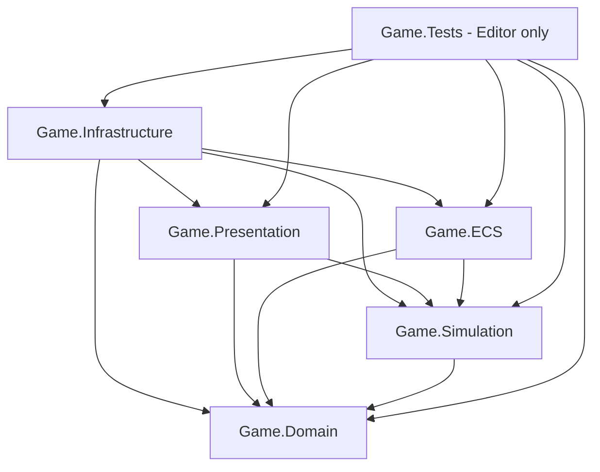

# Architecture — U01

## Scope and source
Implemented in U01: five runtime assembly boundaries and Game.Tests (EditMode), dependency checks, and this architecture contract. Runtime files contain assembly metadata only; services below are ownership contracts for later tasks, not implemented gameplay. FRS_Unity.docx sections 4, 33, 39–40 and 42.2–42.7 guide the design. D-008 overrides the original Editor target with Unity 6000.6.4f1.

## Compile-time dependencies
An arrow means a direct assembly reference. All runtime assemblies live under Assets/Game/<layer> and use the matching Game.<layer> namespace.

| Assembly | Direct project references | Ownership |
|---|---|---|
| Game.Domain | None | Stable IDs, canonical serializable world/person/cohort models, invariants, pure rules and definition values (U04 onward). |
| Game.Simulation | Domain | Clock/calendar (U03), centralized tick scheduling, use cases, commands/queries, RNG streams, tier transitions and aggregate simulation. Defines ports consumed by orchestration. |
| Game.ECS | Domain, Simulation | Tier2 components/jobs/systems and adapter implementing the Simulation tier execution port. Maps stable IDs to transient Entity handles. DOTS implementation starts U12. |
| Game.Presentation | Domain, Simulation | Tier1 views, cameras/input, UI, animation/audio/VFX; converts input into commands and renders snapshots/events. No ownership of persistent state. |
| Game.Infrastructure | Domain, Simulation, ECS, Presentation | Application composition root, save codecs/storage/migrations, configuration and content loading, scene loading and adapter wiring. |
| Game.Tests | All five runtime assemblies | Editor-only architecture checks now; pure unit and adapter tests as features arrive. |

Domain and Simulation set noEngineReferences=true; both are pure C# with no Unity types in their public contracts. Other runtime layers permit Unity API. All five set autoReferenced=false, so predefined assemblies cannot silently couple to them. Explicit assembly references are required for future clients. Unsafe code is disabled. No runtime assembly references tests or UnityEditor.

Infrastructure is deliberately the outermost composition layer: it may construct views and ECS adapters, while neither references Infrastructure. Persistence/configuration ports belong to Simulation, using Domain values. Infrastructure implements those ports and injects them when starting a session. This avoids a sixth runtime bootstrap assembly or dependency cycles. Editor authoring extensions will need a separate Editor-only assembly when introduced.

Entities, Burst, Addressables and camera package dependencies are not added in U01. Game.ECS is a compiled boundary with metadata only. U02 will establish package versions; U12 will add required explicit ECS package references. Changing any edge requires updating this document and its architecture checks.

## State ownership and execution flow
The session owns the canonical Domain state across scene loads. Simulation controls writes and tick order; Presentation receives read models and submits commands, never modifies state through views. Definition assets are authored as ScriptableObjects in Infrastructure and converted into validated immutable Domain values at session creation. They are not mutable save-state.

Planned flow: input -> Simulation command queue -> validate Domain rules -> scheduled simulation step -> commit state -> publish read model/events -> views. A single session driver advances scheduled systems; mass NPCs do not each receive an Update loop. Pause halts advancement while commands remain queueable. Tactical, biological and historical clocks use explicit persisted time values (U03), not wall-clock time or camera visibility.

Tier2 ECS data is a working projection during a scheduled step, not a second independently writable source of truth. Simulation supplies inputs; the ECS adapter completes jobs and returns validated deltas at a synchronization barrier. Only after committing those deltas can saves or tier transitions run. StableEntityId-to-Entity and StableEntityId-to-view maps are transient and rebuilt. Unity instance IDs and Entity indices never appear in persistent references.

Tier1 views may be pooled or destroyed without deleting their Domain records. Tier3 stores cohorts and aggregate state without per-person GameObjects or mandatory ECS entities. Persistent named characters keep individual records and IDs across all tiers. Transition orchestration flushes pending deltas, captures state, releases the old projection, and constructs the new one. Counts/resources must not be represented twice. Failed reconstruction must leave canonical state recoverable. These behaviors require integration tests in U13.

Off-camera snapshots preserve composition, health, supply/inventory, morale, orders, production, timers and RNG state. Outcomes advance from recorded seed/state and stable tick order; camera changes request representation changes and never reroll outcomes (U14).

## Persistence boundary
Simulation coordinates a consistent checkpoint after all pending commands/jobs for that tick are committed. Infrastructure serializes explicit versioned SaveData DTOs representing Domain state plus clocks, RNG and relevant scheduler/timer state. Scene objects, ScriptableObject instances and ECS handles are excluded; content references use stable definition keys. Loading validates schema/content, migrates supported versions and constructs a new session before attaching projections. Serialization format, ID encoding and migration implementation belong to U04; U01 does not choose them prematurely.

## Scene and lifetime strategy
The existing SampleScene remains the sole build scene in U01. No gameplay bootstrap is installed yet. The planned Infrastructure composition root will own one persistent session and the Simulation driver. A small bootstrap scene will create that root once; Local and Global content scenes will load/unload additively around it (U05/U25). Views register/unregister on scene lifetime and never own the session. Before unloading a scene, complete the simulation barrier and commit projections; then dispose subscriptions/jobs and release scene views. Returning binds views to retained state. A new game/load explicitly replaces the session, avoiding duplicate roots and stale static state. Third-person and RTS input will share Simulation commands and combat rules.

## Testing and validation
U01 Game.Tests uses the Unity compilation graph to verify that every runtime boundary participates in Player compilation, its DLL exists, exact approved project references are used, pure layers have no UnityEngine or UnityEditor dependencies, and Game.Tests is excluded from the Player graph. It also checks project asmdefs for cycles and explicit references. Existing U00 environment tests remain in their own Editor-only assembly and continue checking Editor, URP and scenes.

Future pure rule/time tests go in Game.Tests; save/load tests assert state equality including IDs, clocks and RNG. Introduce Game.Tests.PlayMode as a separate test assembly when scene/ECS integration exists; it must remain excluded from normal player builds. Tier transitions, pooling/lifetime and local/global changes need integration coverage. Performance gates and long soak tests belong to U29/U30, not U01.

Run Tools/Verify-U01.ps1 for all current EditMode tests and a Windows x64 Mono Development build using the existing U00Build entry point. This validates assembly boundaries, not gameplay, rendering quality or DOTS functionality. Exact results are recorded in docs/U01_HANDOFF.md.
